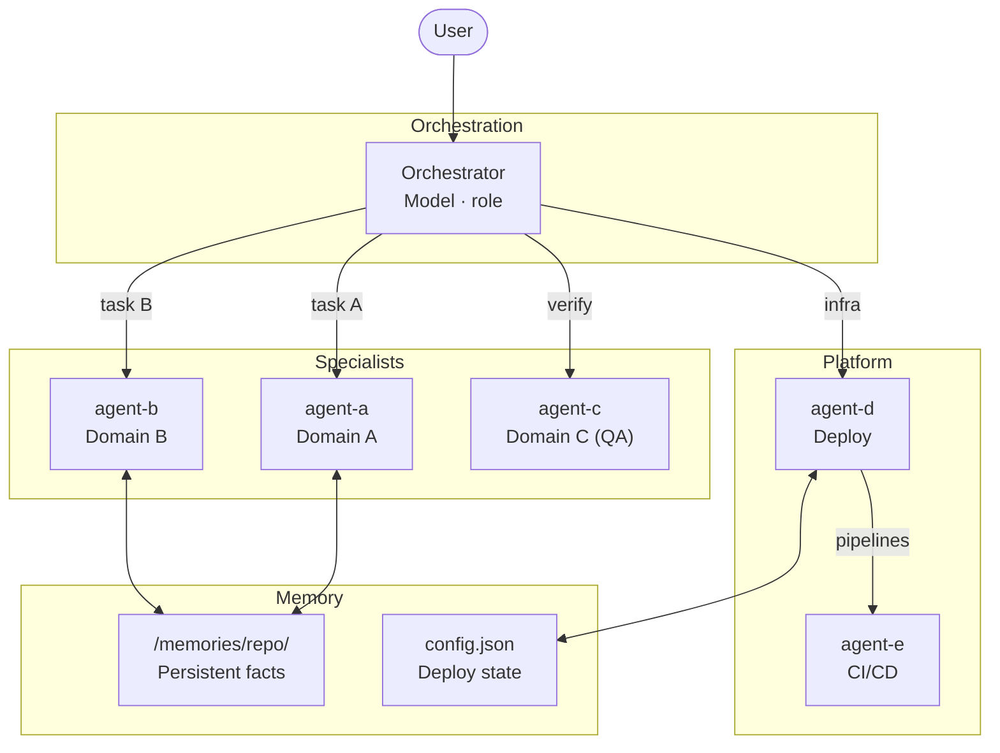

# Create Agent Team Skill

## When to Use

Invoke when the user wants to:

- Set up a new multi-agent team for a project
- Add a specialist agent to an existing team
- Restructure agent roles or delegation rules
- Decide which tools, skills, and docs each agent should own

---

## Step 1 — Clarify Before Designing

**Always ask these questions first.** Do not design anything until you have answers.

Ask the user (one message, all questions at once):

```
Before designing the team, I need a few things:

1. **What is the project?** (e.g., Hugo CMS, .NET API, React app)
2. **What are the main task domains?** (e.g., content, design, testing, deploy)
3. **Do you want a planner agent?** (research-only, Opus-class model — only useful for complex multi-file work)
4. **Any model preferences?** (default: Sonnet for implementation, Haiku for fast/QA, Gemini for design, Opus for planning)
5. **Are there existing agents or skills to reuse?** (check `.github/agents/` and `.github/skills/`)
6. **What shared state do you need?** (config file, memory scopes, or both?)
```

---

## Step 2 — Present the Team Design as Mermaid

Once you have answers, present a diagram **before writing any files**. Keep it to 2 levels max.

### Diagram template



After presenting the diagram, ask:

> "Does this team structure look right? Any roles to add, remove, or rename before I create the files?"

**Wait for confirmation before proceeding.**

---

## Step 3 — Define Each Agent (short checklist)

For each agent, fill in:

| Property         | Decision                                                        |
| ---------------- | --------------------------------------------------------------- |
| **Name**         | Lowercase, hyphenated, domain-scoped                            |
| **Model**        | Sonnet (impl), Haiku (QA/fast), Gemini (design), Opus (planner) |
| **Scope**        | 2–3 sentences max — what it owns                                |
| **Tools**        | Minimum needed (least privilege)                                |
| **Skills**       | Skills from `.github/skills/` it should invoke                  |
| **Docs**         | `docs/` files it reads                                          |
| **Delegates to** | Which agents it hands off to                                    |

### Model selection guide

| Use case                        | Model             |
| ------------------------------- | ----------------- |
| Orchestration, implementation   | Claude Sonnet 4.6 |
| QA, screenshots, fast loops     | Claude Haiku 4.5  |
| Visual design, creativity       | Gemini 3.1 Pro    |
| Deep research, complex planning | Claude Opus 4.5   |

### Tool assignment rules (least privilege)

- **Orchestrator**: read + search + memory + agent/runSubagent + minimal edit
- **Implementation agents**: read + search + edit + execute + memory
- **QA/test agents**: read + browser tools only — **no edit tools**
- **Planner agents**: read + search + memory only — **no edit, no execute, no agent/runSubagent**
- **Deploy agents**: execute + azure/github tools + read + memory

---

## Step 4 — Memory Strategy

Choose one or both:

### Option A — `/memories/repo/` (persistent, cross-session)

- All agents write facts using `vscode/memory`
- Survives session restarts
- Best for: build commands, conventions, schema decisions

### Option B — Shared config file

- One agent owns the file (reads AND writes)
- Others read it as input
- Best for: deploy config, environment URLs, secrets references

### Planner rule (always apply)

> The planner agent is **never invoked automatically**. Only when the user explicitly asks for it or names it. Add this to every agent's delegation table.

---

## Step 5 — Implement

Create all `.github/agents/<name>.agent.md` files. Use this frontmatter template:

```yaml
---
name: agent-name
description: >-
  One paragraph. What it does, what it owns, what it delegates.
argument-hint: >-
  What input to give it (e.g., "describe the task: create a new class page").
model: Claude Sonnet 4.6 (copilot)
tools: [vscode/memory, read/readFile, edit/editFiles, search/codebase, agent/runSubagent, todo]
---
```

### Agent body structure (keep short)

```markdown
# Agent Name — Role

One-line purpose statement.

## Scope
- Bullet 1
- Bullet 2

## Delegation Rules
| Task | Delegate to |
| ---- | ----------- |
| X    | agent-b     |
| Pre-implementation planning | hugo-planner — only when user explicitly requests it |

## Workflow
1. Step 1
2. Step 2
3. Step 3

## Skills to Invoke
- `skill-name` — when to use it

## Docs
- `docs/FILE.md` — what it contains
```

---

## Step 6 — Update the Orchestrator's Delegation Table

After all agents are created, verify the orchestrator's delegation table covers every agent. Every specialist must appear at least once.

Also update `docs/hugo-skills.md` (or equivalent) if new agents were added.

---

## Lessons Learned (from building the Hugo CMS team)

- **Start with the delegation table** — it forces clarity on boundaries before you write a single agent
- **Give QA agents zero edit tools** — separates the "find" role from the "fix" role cleanly
- **Use a cheap/fast model for QA** (Haiku) — screenshot loops don't need Sonnet reasoning
- **Use Gemini for design agents** — better at visual reasoning and aesthetic tasks
- **One shared config file per platform concern** (e.g., `.hugo/hugo.config.json` for Azure) — don't scatter state
- **The planner is expensive and optional** — make it opt-in, never automatic
- **Docs ownership drives agent identity** — each agent should own a specific subset of `docs/`; if two agents both "own" the same doc, their roles overlap too much
- **Agent-scoped hooks (VS Code 1.111+)** — available via `hooks:` frontmatter + `chat.useCustomAgentHooks` setting for pre/post-processing per agent invocation
