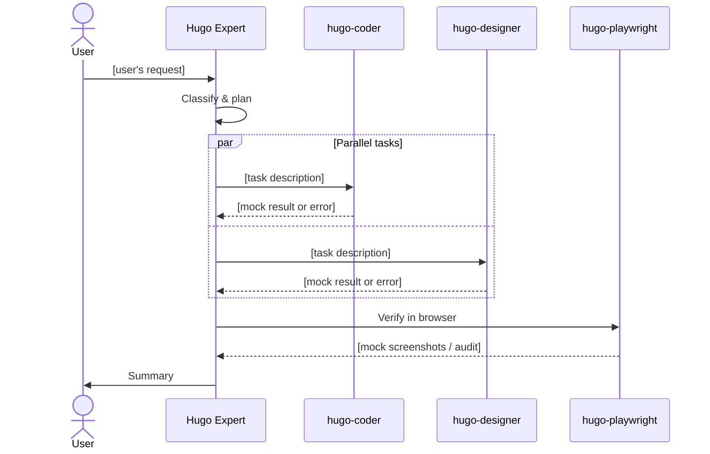

# hugo-dry-run

Simulate how the Hugo Expert agent team would handle a request — no files changed.

## Triggers
"dry run", "simulate", "how would the team handle", "mock run", "test the agents", "visualize delegation"

## When to Use
- Understand delegation and sequencing before committing to real changes
- Test agent routing logic for a complex cross-cutting request
- Produce a Mermaid sequence diagram + mock agent outputs including realistic errors
- Learn the team structure through a safe walkthrough

## Agent Roster

| Agent | Handles |
|-------|---------|
| `hugo-coder` | Templates, layouts, partials, content |
| `hugo-designer` | CSS variables, images, visual polish |
| `hugo-playwright` | Screenshots, Lighthouse, QA audits |
| `azure-deployment` | Azure infra, SWA, OIDC |
| `GitHub Actions Specialist` | CI/CD workflows |
| `Angular Expert` | Angular Element source changes |
| `hugo-planner` | Complex multi-file planning |

## Sequence Diagram Template



## Mock Agent Output Format

```
### 🤖 hugo-coder
**Task**: Create layout partial for X
**Files touched**: src/integrations.at/layouts/partials/X.html
**Status**: ✅ Done
**Output**: Partial created with semantic HTML, front matter wired to .Params.X
```

Include 1–2 realistic errors across agents:
- `⚠️ Warning: Image referenced in front matter not found in static/images/`
- `❌ Error: CSS variable --color-accent not defined — hugo-designer must add it first`
- `⚠️ Warning: Lighthouse accessibility score 87 — missing aria-label on CTA`
